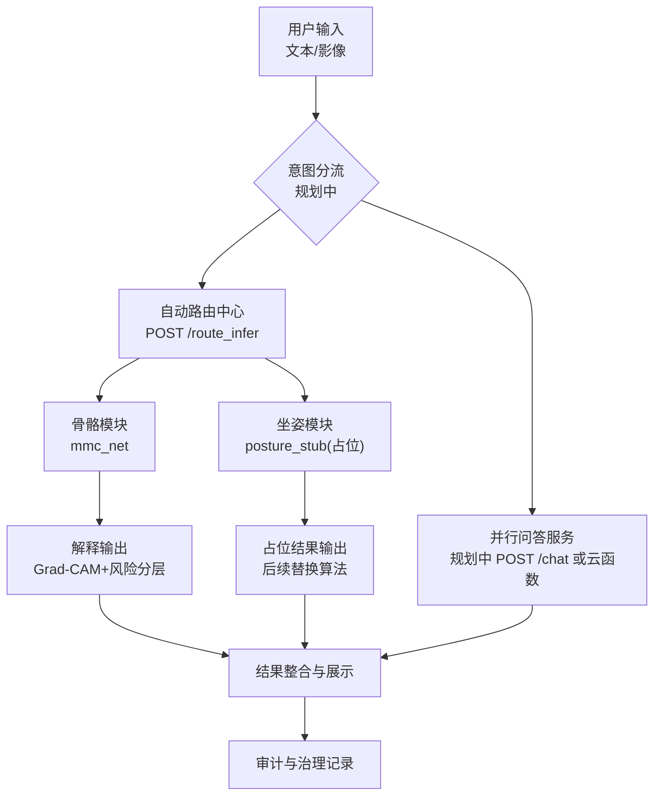
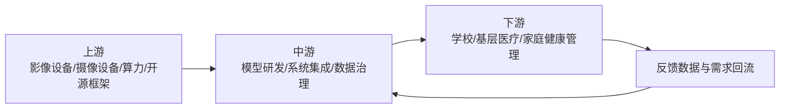
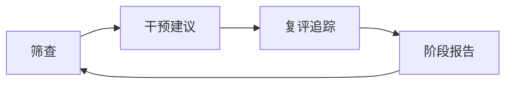
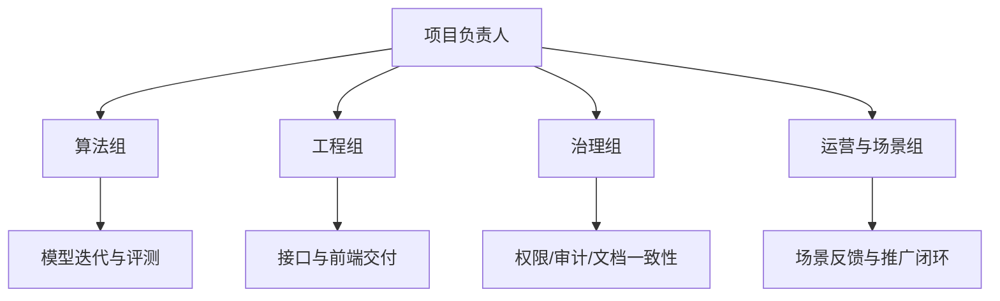
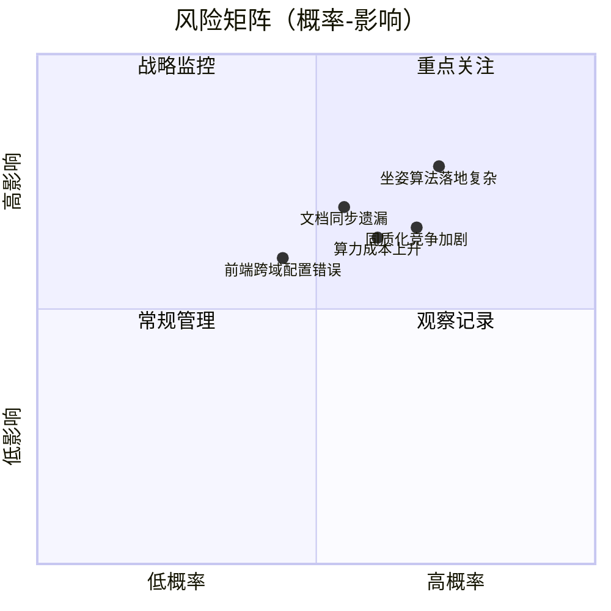

# 灵枢AI项目计划书（详细版）

> 版本：v1.0（详细重写版，约25页体量）  
> 项目名称：灵枢AI——青少年骨骼健康智能评估系统  
> 文档口径：仅采用当前项目可验证事实与已落地能力；对未实测内容明确标注“阶段目标/规划中”

---

## 目录

1. 执行摘要与项目全景  
2. 产品服务与技术体系  
3. 市场分析与产业链判断  
4. 竞争分析与竞争优势  
5. 商业模式与价值闭环  
6. 营销策略与落地路径  
7. 发展规划与里程碑（含 §7.4 双通道：推理路由与并行问答）  
8. 组织管理与执行保障  
9. 风险控制与治理机制  
10. 图表索引与数据来源说明  

---

## 第一章 执行摘要与项目全景

### 1.1 项目名称与定位

灵枢AI定位为“青少年骨骼健康管理入口级平台”，核心是将骨骼影像辅助评估与坐姿行为干预放在同一业务闭环内，服务学校、基层医疗和家庭三类高频场景。

**结论**  
项目不是单一算法模型，而是“技术能力 + 服务能力 + 治理能力”的组合产品。

**依据**  
- 已具备骨骼模块推理与可解释输出能力。  
- 已具备自动路由与接口服务化能力。  
- 已沉淀数据库设计、云函数权限与问题修复文档机制。

**取舍**  
短期优先“可用性和可信性”，不追求过度复杂功能堆叠。

**风险**  
若只讲算法精度、弱化交付与治理，项目在答辩与落地中可信度会下降。

**后续动作**  
持续把每次功能演进同步到“接口能力 + 文档证据 + 回归验证”三件套。

### 1.2 项目背景

青少年长期伏案学习、电子设备使用增加，低头、弯腰、久坐等行为风险上升。与此同时，基层医疗影像资源紧张，学校健康筛查缺乏连续工具，家校医协同存在信息断层。

灵枢AI希望解决三件事：  
1) 提前发现骨骼健康风险；  
2) 提供可执行的行为干预建议；  
3) 形成可持续复评机制。

### 1.3 核心价值主张

- 对学校：提高筛查效率，降低漏检风险。  
- 对基层医疗：提升初筛一致性，释放医生时间。  
- 对家庭：给出看得懂、可执行、可跟踪的健康建议。  
- 对社会：推动青少年骨骼健康从“被动就诊”向“主动预防”迁移。

### 1.4 项目阶段全景（2025.11-2026.04）

**图1 数据口径说明**  
来源于项目阶段叙事与现有交付记录（计划书、申报材料、问题修复记录）。

### 1.5 已实现能力与规划能力总览

| 能力域 | 已实现 | 规划中 | 真实性说明 |
|---|---|---|---|
| 骨骼影像推理 | 是 | 持续优化 | 已有接口与模块配置可验证 |
| 多模态输入（图像+文本+结构化） | 是 | 持续优化 | 后端推理逻辑已落地 |
| Grad-CAM可解释热图 | 是 | 热图质量优化 | 推理接口已返回热图路径 |
| 自动路由（骨骼/坐姿） | 是 | 路由策略升级 | `route_infer` 已支持 |
| 坐姿检测算法化 | 否（占位接口） | 是 | 当前为占位接口，已明确标注 |
| API鉴权与限流 | 是 | 精细化策略 | 已有401/403/429实测验收 |
| 云治理文档联动 | 是 | 持续执行 | 数据库/权限/问题修复文档已存在 |
| 健康科普/操作指南类**并行问答**（与 `route_infer` 解耦） | 否 | 是 | **阶段目标**：见 §7.4；不替代影像推理，仅承担非诊断性自然语言交互 |

---

## 第二章 产品服务与技术体系

### 2.1 产品概述

灵枢AI由“前端交互层—路由编排层—任务模块层—解释与治理层”组成。用户既可以输入问题，也可以上传骨骼影像。系统根据输入自动路由，输出风险分层结果与解释证据。

### 2.2 产品整体工作原理（业务流）

**图2 数据口径说明**  
来源于后端接口实现、配置体系与文档说明。图中「意图分流 / 并行问答」为路线图规划：**V1.0 前端仍统一走 `route_infer`**；落地并行问答后，纯咨询类对话与影像/风险推理分流，避免无影像场景误走骨骼路由。

### 2.3 技术体系详解

#### 2.3.1 多模态融合模型（核心）

模型并非仅看影像，而是综合三类输入：  
- 影像特征（X线/DR）  
- 文本语义（症状/问答）  
- 结构化特征（年龄、风险因子等）

这种设计更贴近真实临床判断逻辑，能够在信息不完整场景下保持更稳的输出。

#### 2.3.2 可解释性机制（Grad-CAM）

系统在影像推理后生成热图，突出模型重点关注区域。对答辩和实际使用的意义：  
- 结果可复核，降低“黑箱感”；  
- 便于医生/教师/家长沟通；  
- 便于后续误判分析与模型迭代。

#### 2.3.3 服务层（API与工程化）

已提供核心接口：  
- `GET /health`  
- `POST /infer`  
- `POST /infer_with_image`  
- `POST /route_infer`  
- `GET /posture/info`  
- `POST /posture/analyze`  

**路线图中与 `route_infer` 并行的问答服务（阶段目标，尚未在仓库默认启用）**  
- 职责：承接「科普、使用说明、流程引导、非诊断性健康宣教」等纯文本对话；**不输出个体诊断结论**，与 MMC 风险分数、`route_infer` 路由结果解耦。  
- 形态（择一或组合）：自建 `POST /chat`（FastAPI 转发至大模型 API）、或云开发 **云函数**（如 `qa-assistant`），与现有 `X-API-Key`、限流、审计字段对齐。  
- 上线时需同步更新：`云数据库设计.md`（对话会话/消息摘要字段）、`云函数权限说明.md`（问答接口 IAM）、`问题修复总结.md`。

工程化保障：  
- API Key鉴权；  
- 限流控制（按`API Key + IP`）；  
- CORS白名单；  
- 路由模式可控（`auto`/`force_bone`/`force_posture`）。

#### 2.3.4 模块化架构

通过 `active_module + modules/*.yaml`，支持新增模块时不修改训练/推理主干代码。  
该机制是“后续可持续扩展”核心抓手。

### 2.4 产品部件详细介绍

| 部件 | 作用 | 当前状态 | 下一步 |
|---|---|---|---|
| 前端演示页 | 问答+上传+结果可视化 | 已上线深色版演示页 | 增加多场景导航 |
| 路由中心 | 文本+影像分流 | 已支持自动/强制路由 | 增加路由评估指标 |
| 骨骼模块 | 多模态风险评估 | 已可运行 | 提升稳健性 |
| 坐姿模块 | 行为风险评估 | 占位接口已挂载 | 接入关键点与规则引擎 |
| 解释层 | 热图+文字说明 | 已输出Grad-CAM | 增强可读性模板 |
| 治理层 | 审计与权限 | 文档和策略已落地 | 扩展自动化检查 |
| 并行问答层 | 非诊断性文本对话（与 `route_infer` 并行） | 规划中 | 见 §7.4；前端意图分流与免责声明 |

### 2.5 产品服务包设计（按应用对象）

#### A. 校园筛查服务包
- 面向：校医/班主任/健康管理老师  
- 输出：风险分层、重点关注对象清单、周期复评建议

#### B. 基层辅助服务包
- 面向：基层医生/门诊初筛  
- 输出：辅助判读线索、可解释证据、复查建议

#### C. 家庭随访服务包
- 面向：家长与学生  
- 输出：行为改善建议、阶段性变化记录

### 2.6 真实性声明（技术章）

本章涉及的“已实现”均可在现有接口、配置与文档中对照；未接入完整算法的坐姿能力已明确标注为占位阶段。

---

## 第三章 市场分析与产业链判断

### 3.1 市场发展现状与机会窗口

青少年健康管理正从“经验驱动”向“数据驱动”演进，尤其在校园场景，数字化工具需求持续增长。医学影像AI与姿态识别技术基础成熟，但多数产品停留在单点能力层，缺少跨场景闭环。

### 3.2 上中下游产业链分析

**图3 产业链口径说明**  
采用项目现有应用场景与技术栈映射，不引入外部估算数据。

### 3.3 市场痛点分析

| 痛点 | 当前表现 | 影响 |
|---|---|---|
| 早筛能力不足 | 人工筛查资源有限 | 发现延后 |
| 干预持续性不足 | 提醒无数据支撑 | 执行中断 |
| 协同割裂 | 家校医信息不统一 | 沟通成本高 |
| 信任不足 | 黑箱结论难解释 | 采纳率低 |

### 3.4 市场定位

灵枢AI定位在“高频、刚需、可复制”的入口层：  
- 高频：校园日常管理频次高；  
- 刚需：青少年骨骼健康问题持续存在；  
- 可复制：模块化+API化降低跨场景迁移成本。

### 3.5 市场前景（阶段表达）

- 短期：校赛展示 + 小范围试点形成证据样板。  
- 中期：从单校试点扩展到区域协同应用。  
- 长期：形成标准化健康管理能力包并拓展到更多机构。

### 3.6 SWOT图表化分析

| 维度 | 关键点 | 对应动作 |
|---|---|---|
| S 优势 | 多模态+可解释+模块化 | 强化演示与标准化交付 |
| W 劣势 | 坐姿算法尚未完全落地 | 分阶段替换占位接口 |
| O 机会 | 校园数字健康需求增长 | 先试点后复制 |
| T 威胁 | 同质化竞争与合规压力 | 构建治理与可信壁垒 |

---

## 第四章 竞争分析与竞争优势

### 4.1 竞争格局

当前主要竞品类型：  
1) 单一影像AI产品；  
2) 单一坐姿检测产品；  
3) 通用健康管理平台。

灵枢AI核心竞争方向不是某单项性能极值，而是“跨角色协同 + 结果可解释 + 可持续扩展”。

### 4.2 竞品维度对比（项目口径）

| 对比维度 | 单一影像工具 | 单一姿态工具 | 通用平台 | 灵枢AI |
|---|---|---|---|---|
| 覆盖骨骼影像 | 强 | 弱 | 中 | 强 |
| 覆盖行为干预 | 弱 | 强 | 中 | 中（已占位、规划强化） |
| 可解释证据 | 中 | 弱 | 弱/中 | 强（Grad-CAM） |
| 模块扩展性 | 中 | 中 | 中 | 强（模块化配置） |
| 接口服务化 | 中 | 中 | 强 | 强 |
| 治理文档联动 | 弱 | 弱 | 中 | 强 |

### 4.3 竞争优势拆解

#### 4.3.1 技术优势
- 多模态融合而非单模态判断。  
- 可解释输出提升可信度。  
- 路由机制提升交互效率。

#### 4.3.2 工程优势
- 模块化设计降低新增功能成本。  
- API化便于前后端与外部系统集成。  
- 安全与审计策略已落地。

#### 4.3.3 管理优势
- 文档先行机制明确：数据库、权限、问题复盘。  
- 每次问题修复可沉淀“根因—修复—预防”闭环。

### 4.4 潜在应用价值

- 校园健康管理“规模化筛查”能力提升。  
- 基层医疗“初筛辅助”能力提升。  
- 家庭场景“行为改善跟踪”能力提升。  

---

## 第五章 商业模式与价值闭环

### 5.1 价值主张

为学校和基层医疗提供“更早发现风险、更低执行成本、更高协同效率”的青少年骨骼健康管理服务。

### 5.2 客户细分

- 直接客户（B端）：学校、校医系统、基层医疗机构、健康管理机构。  
- 间接用户（C端）：家长、学生、教师、校医。

### 5.3 商业模式画布（精简）

| 模块 | 内容 |
|---|---|
| 价值主张 | 骨骼影像+行为干预闭环 |
| 客户细分 | 学校、基层医疗、健康管理机构 |
| 渠道 | 试点合作、区域合作、联合示范 |
| 客户关系 | 项目制服务+周期复盘 |
| 收入来源 | 项目服务费、部署与运维服务 |
| 核心资源 | 算法能力、工程能力、治理能力 |
| 关键活动 | 模型迭代、场景部署、培训支持 |
| 关键伙伴 | 学校、医院、技术平台伙伴 |
| 成本结构 | 人力、算力、部署、运维、合规 |

### 5.4 收入与成本逻辑（非虚构口径）

当前阶段以“能力建设与场景验证”为主，尚未进入大规模商业化数据统计阶段，因此本计划书仅给出结构化商业路径，不给出未经验证的营收绝对值预测。

### 5.5 价值闭环路径

**图4 价值闭环口径说明**  
基于现有项目目标与服务设计，不包含未经试点验证的量化收益。

---

## 第六章 营销策略与落地路径

### 6.1 目标市场营销策略

采用“试点先行—样板输出—区域复制”策略：  
- 第一阶段：1-2个样板场景打透；  
- 第二阶段：复制到同类机构；  
- 第三阶段：区域级联动。

### 6.2 销售策略

- 前期：竞赛展示与试点合作为主。  
- 中期：形成标准部署包和服务包。  
- 后期：形成分层产品与增值服务体系。

### 6.3 推广策略

- 内容推广：案例、白皮书、专家评审意见。  
- 场景推广：筛查效率与行为改善的可视化成果。  
- 联合推广：学校、校医、基层医生多角色联合背书。

### 6.4 促销与转化策略

- 试点期“低门槛接入 + 固定周期复盘”。  
- 建立“首个成功案例”作为对外转化抓手。  
- 以过程指标（覆盖率、响应率、复评率）引导续用。

### 6.5 品牌策略

品牌关键词：可信、可解释、可落地、可持续。  
品牌核心叙事：不是替代专家，而是让专业能力更可及。

### 6.6 服务与技术支持体系

| 支持类型 | 内容 | 节奏 |
|---|---|---|
| 使用培训 | 用户操作、结果解读 | 上线前+月度复训 |
| 技术支持 | 故障排查、版本迭代 | 按需响应+周期发布 |
| 运营支持 | 场景复盘、指标回顾 | 双周/双月复盘 |
| 合规支持 | 权限审计、文档同步 | 每次能力变更同步 |

---

## 第七章 发展规划与里程碑

### 7.1 发展阶段划分

#### 阶段A（0-6个月）
- 骨骼模块稳定运行与展示强化。  
- 坐姿模块由占位向可用版本过渡。  
- 完成首批场景反馈闭环。

#### 阶段B（6-18个月）
- 完成联合评分和报告标准化。  
- 扩展多机构试点。  
- 建立标准运维与培训机制。

#### 阶段C（18个月以上）
- 形成区域级解决方案能力。  
- 完善行业合作网络与扩展模块库。

### 7.2 2025.11-2026.04时间轴（已发生）

| 时间 | 关键事件 | 产出 |
|---|---|---|
| 2025.11 | 负责人进入重点实验室 | 明确项目方向与研究基础 |
| 2025.12 | 组建团队 | 完成角色分工与路线拆解 |
| 2026.01-02 | 多轮实验与联调 | 形成可演示技术链路 |
| 2026.03 | 实地调研 | 获得场景痛点与反馈 |
| 2026.04 | 第一代灵枢AI发布 | 完成计划书/申报/演示系统 |

### 7.3 目标体系

| 目标类型 | 当前状态 | 下一阶段目标 |
|---|---|---|
| 技术目标 | 骨骼主链路已通 | 坐姿算法升级、联合评分 |
| 产品目标 | 演示版可用 | 标准化部署与复评看板 |
| 运营目标 | 校赛级表达完善 | 场景化试点验证 |
| 治理目标 | 文档机制已建立 | 自动化核验机制完善 |

### 7.4 双通道服务路线图：`/route_infer` 与并行问答服务

**问题背景**  
仅输入文字时，若统一调用 `route_infer`，系统会按关键词向骨骼/坐姿模块路由；在未上传影像或模块配置不匹配时，易造成「调用失败」或误解为系统不支持对话。产品与工程上应将 **影像/行为推理链** 与 **开放域（受控）文本问答链** 分离。

**通道划分**

| 通道 | 接口（规划名可调整） | 适用场景 | 不负责 |
|---|---|---|---|
| 推理路由通道 | `POST /route_infer`（已落地） | 需风险分数、热图、坐姿占位等与模型/路由相关输出 | 泛科普长对话、个体诊断断言 |
| 并行问答通道 | `POST /chat` 或云函数 `qa-assistant`（阶段目标） | 使用帮助、流程说明、健康科普、随访话术建议（非诊断） | 替代影像判读结论；须在 UI 固化免责与转介提示 |

**阶段目标（与 V1.0→V1.5 衔接）**

- **V1.0（当前交付）**：以 `route_infer` + 已有推理接口为主；文档明确「纯文本不等同于通用聊天」。  
- **下一迭代**：增加轻量意图识别或显式 Tab（「问一问」/「影像分析」），纯咨询走问答通道；上传影像或明确筛查意图仍走 `route_infer`。  
- **合规与安全**：问答通道复用 API Key/限流；响应模板含「不替代执业医师判断」；敏感问题走拒答或转介话术。  
- **治理交付物**：上线并行问答云函数或接口当日，更新云数据库文档、云函数权限文档与问题修复总结。

**依赖与风险**  
- 大模型 API 成本与可用性；需配额与降级（只读 FAQ）策略。  
- 意图分类错误时可能仍误调 `route_infer`——需前端可重试与模式切换。

**后续动作**  
原型期可用环境变量切换问答后端；稳定后写入 `default.yaml` 或云开发配置，并在 README 增加调用说明。

---

## 第八章 组织管理与执行保障

### 8.1 团队组织架构

### 8.2 团队成员与专家顾问机制

- 项目负责人：负责战略与资源协调。  
- 算法负责人：负责模型路线与指标把控。  
- 工程负责人：负责接口稳定性和系统可用性。  
- 治理负责人：负责合规边界与文档一致性。  
- 专家顾问：提供医学与教育场景专业评审。

### 8.3 部门职责与分工矩阵

| 工作项 | 算法组 | 工程组 | 治理组 | 运营组 |
|---|---|---|---|---|
| 模型开发 | 主责 | 配合 | 配合 | 配合 |
| 接口发布 | 配合 | 主责 | 配合 | 配合 |
| 文档更新 | 配合 | 配合 | 主责 | 配合 |
| 场景对接 | 配合 | 配合 | 配合 | 主责 |
| 复盘改进 | 主责 | 主责 | 主责 | 主责 |

### 8.4 人力资源管理策略

- 招募：技术能力与场景理解并重。  
- 绩效：以里程碑达成、质量与协作评价为核心。  
- 培养：定期技术分享与案例复盘。  
- 备份：关键岗位双人覆盖，降低单点风险。

### 8.5 执行机制

- 周节奏：任务看板跟踪。  
- 双周节奏：版本回顾与问题闭环。  
- 月节奏：指标复盘与计划修正。  
- 变更节奏：功能上线必须同步文档与审计策略。

---

## 第九章 风险控制与治理机制

### 9.1 技术风险及应对

| 风险 | 影响 | 应对措施 |
|---|---|---|
| 坐姿算法落地复杂 | 影响双模块联动体验 | 先占位后替换，分阶段上线 |
| 泛化能力不足 | 场景稳定性下降 | 建立分层测试与回归机制 |
| 解释结果可读性不稳定 | 用户信任受影响 | 固化解释模板与复核流程 |

### 9.2 市场风险及应对

| 风险 | 影响 | 应对措施 |
|---|---|---|
| 客户决策周期长 | 推进节奏变慢 | 先试点出样板再复制 |
| 同质化竞争加剧 | 差异化被削弱 | 强化闭环与治理优势 |

### 9.3 经营风险及应对

| 风险 | 影响 | 应对措施 |
|---|---|---|
| 跨机构协同成本高 | 交付效率下降 | 标准化交付包与SOP |
| 协作链路复杂 | 沟通成本上升 | 里程碑驱动与职责清单 |

### 9.4 财务风险及应对

| 风险 | 影响 | 应对措施 |
|---|---|---|
| 算力与运维成本上升 | 现金流压力增加 | 分层服务与模块复用 |
| 收益释放滞后 | 阶段回报不稳定 | 试点+续费双路径 |

### 9.5 知识产权风险及应对

| 风险 | 影响 | 应对措施 |
|---|---|---|
| 文档与成果被不当复制 | 竞争壁垒受损 | 完善软著与版权管理 |
| 开源组件许可不清晰 | 法律风险 | 建立许可证审查清单 |

### 9.6 风险矩阵（概率-影响）

> 注：矩阵坐标用于风险分层表达，为管理口径评分，不代表外部统计数据。

### 9.7 治理机制（硬约束）

#### 9.7.1 云函数迭代前置检查

每次新增云函数，必须先检查并更新：  
1) 数据库文档；  
2) 云函数权限文档。

#### 9.7.2 问题修复沉淀机制

每次问题修复后，必须追加到“问题修复总结”，并记录：  
- 问题现象；  
- 根因分析；  
- 修复方案；  
- 回归验证；  
- 预防动作。

#### 9.7.3 治理对照表

| 功能演进 | 数据库文档 | 权限文档 | 问题修复总结 |
|---|---|---|---|
| 推理与热图能力 | 已覆盖产物集合 | 已覆盖权限矩阵 | 已有修复记录 |
| 鉴权与限流能力 | 已覆盖审计日志 | 已覆盖安全策略 | 已有验收闭环 |
| 自动路由与坐姿占位 | 已覆盖route_mode说明 | 已覆盖routeInfer权限 | 已记录演进与修复 |

---

## 第十章 图表索引与数据来源说明

### 10.1 图表索引

| 编号 | 图表名称 | 所在章节 |
|---|---|---|
| 图1 | 项目阶段时间轴 | 第一章 |
| 图2 | 产品整体工作流图（含并行问答规划） | 第二章 |
| 图3 | 产业链关系图 | 第三章 |
| 图4 | 价值闭环图 | 第五章 |
| 图5 | 组织结构图 | 第八章 |
| 图6 | 风险矩阵图 | 第九章 |
| 表1 | 已实现/规划能力清单 | 第一章 |
| 表2 | 部件与状态表 | 第二章 |
| 表3 | 市场痛点表 | 第三章 |
| 表4 | 竞品对比表 | 第四章 |
| 表5 | 商业模式画布表 | 第五章 |
| 表6 | 服务支持表 | 第六章 |
| 表7 | 时间轴里程碑表 | 第七章 |
| 表10 | 双通道服务（推理路由 vs 并行问答）路线图 | 第七章 §7.4 |
| 表8 | 风险应对总表 | 第九章 |
| 表9 | 治理对照表 | 第九章 |

### 10.2 数据来源与真实性说明

本计划书数据口径来自以下内部可验证资料：  
- 项目总览与接口能力：`workspace/01_文档/README.md`  
- 技术路线与竞赛叙事：`workspace/01_文档/docs/07_挑战杯申报书骨骼健康版.md`、`workspace/01_文档/docs/08_挑战杯申报书提交版.md`  
- 安全与治理依据：`workspace/01_文档/docs/云数据库设计.md`、`workspace/01_文档/docs/云函数权限说明.md`、`workspace/01_文档/docs/问题修复总结.md`  
- 接口实现依据：`workspace/02_工程/src/api/infer_api.py`

### 10.3 口径边界声明

- 本文不编造未经实测的精度数字、营收数据和覆盖规模。  
- 对尚未完成的坐姿算法能力，统一标注为“规划中/阶段目标”。  
- 风险矩阵为项目管理评分模型，不等同于外部统计结果。

---

## 结语

灵枢AI详细计划书以“真实可验证”为底线，以“技术-产品-治理协同”为主线，形成了从研发到应用、从能力到交付、从功能到合规的完整方案。项目当前已具备骨骼影像主能力与服务化能力，下一阶段将重点推进坐姿算法化升级、**与 `route_infer` 并行的受控问答服务落地**与场景化试点复制，持续提升项目的社会价值与落地强度。
